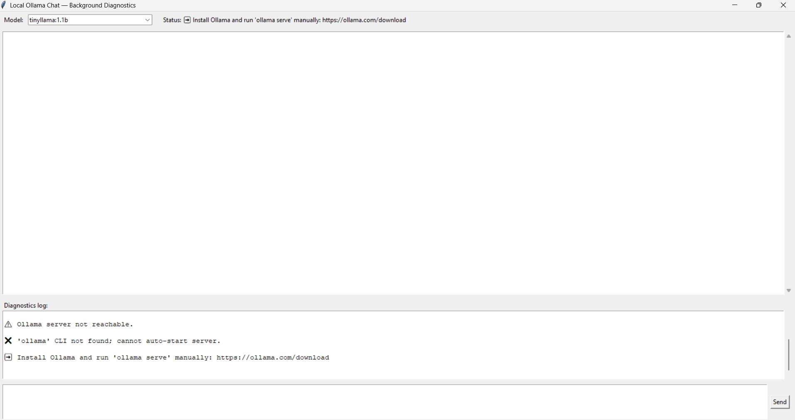

# Local Privacy LLM Chat GUI

A lightweight, cross-platform desktop chat application for local LLMs built with Python and Tkinter. This application operates fully offline via [Ollama](https://ollama.com/), providing built-in lifecycle management, model handling, and real-time status logging in a single file.

## Screenshot


## Key Features

* **Zero-Setup Dependency Management:** Automatically detects and installs required Python packages (`ollama`, `requests`) at runtime using `pip`.
* **Automated Ollama Service Management:** Checks whether the local Ollama server is running and automatically attempts to launch `ollama serve` in a non-blocking background process if offline.
* **Auto Model Downloader:** Checks for standard lightweight models on startup and automatically triggers CLI downloads for any missing required models.
* **Real-Time Diagnostic Panel:** Built-in collapsible diagnostic log displaying background tasks, polling status, download progress, and error tracing.
* **Direct Client Integration:** Interacts directly with local models via the official `ollama` Python package—no external API keys or intermediate HTTP standard requests needed.
* **Cross-Platform:** Out-of-the-box compatibility with Windows, macOS, and Linux.

## Included Models

The application checks for and may download the following models:

- `tinyllama:1.1b`
- `phi3:mini`
- `phi:2`
- `llama3.2:1b`
- `llama3.2:3b`
- `gemma:2b`
- `qwen2:0.5b`
- `qwen2.5:0.5b`
- `qwen2.5:1.5b`

Downloading every model can require significant disk space and bandwidth.

## Requirements

- Python 3.8 or newer
- Ollama installed and available in your system `PATH`
- Tkinter support
- Internet access for:
  - Installing Python dependencies
  - Downloading Ollama models

Install Ollama from:

<https://ollama.com/download>

### Tkinter Notes

Tkinter is included with most Python installations, but some Linux distributions require a separate package.

For Debian or Ubuntu:

```bash
sudo apt install python3-tk
```

## Installation

Save the script as:

```text
local_ollama_chat.py
```

The script installs the following Python packages automatically if they are missing:

- `ollama`
- `requests`

`requests` is currently included for possible future use but is not required by the chat implementation.

You can also install the Ollama client manually:

```bash
python -m pip install ollama requests
```

## Running the Application

Run the script with Python:

```bash
python local_ollama_chat.py
```

On macOS or Linux, you may need to make the file executable first:

```bash
chmod +x local_ollama_chat.py
./local_ollama_chat.py
```

## Startup Behavior

When the application starts, it performs the following operations in a background thread:

1. Imports the Ollama Python client.
2. Checks whether the Ollama server is reachable.
3. If the server is unavailable, attempts to run:

   ```bash
   ollama serve
   ```

4. Waits up to 60 seconds for the server to become reachable.
5. Checks whether each configured model is installed.
6. Pulls any missing models using commands such as:

   ```bash
   ollama pull llama3.2:1b
   ```

7. Displays progress and errors in the diagnostics log.

The application does not block the GUI while diagnostics are running.

## Using the Chat Interface

1. Select a model from the model dropdown.
2. Type a message in the input box.
3. Click **Send**, or press:
   - `Ctrl+Enter` on Windows and Linux
   - `Command+Enter` on macOS
4. The prompt and model response appear in the chat history.

Each chat request is sent using the Ollama Python client:

```python
ollama.chat(
    model=model,
    messages=[{"role": "user", "content": prompt}]
)
```

## Troubleshooting

### Ollama CLI Not Found

If the diagnostics log reports that the `ollama` command cannot be found:

1. Install Ollama.
2. Confirm that the `ollama` command is available in your `PATH`:

   ```bash
   ollama --version
   ```

3. Restart the terminal or application after updating your `PATH`.

You can also start the server manually:

```bash
ollama serve
```

### Ollama Server Is Not Reachable

Start Ollama manually:

```bash
ollama serve
```

Then restart the Python application.

### A Model Cannot Be Downloaded

Try pulling the model manually:

```bash
ollama pull llama3.2:1b
```

Check that:

- Ollama is installed correctly.
- The Ollama server is running.
- You have internet access.
- You have enough available disk space.
- The model name is valid.

### Tkinter Is Missing

Install the Tkinter package for your operating system. On Debian-based Linux systems:

```bash
sudo apt install python3-tk
```

### Chat Messages Fail During Startup

Chat requests may fail while the background diagnostics are still checking or starting Ollama. Wait for the diagnostics to complete and try again.

## Project Structure

This project is intentionally contained in a single Python file:

```text
local_ollama_chat.py
```

The file contains:

- Dependency installation
- Ollama server detection
- Ollama server startup
- Model availability checks
- Model downloading
- Background diagnostics
- Tkinter GUI
- Chat request handling
- Application startup logic

## Configuration

The main configuration values are defined near the top of the script:

```python
SMALL_MODELS = [
    "tinyllama:1.1b",
    "phi3:mini",
    "phi:2",
    "llama3.2:1b",
    "llama3.2:3b",
    "gemma:2b",
    "qwen2:0.5b",
    "qwen2.5:0.5b",
    "qwen2.5:1.5b",
]

DIAG_POLL_INTERVAL = 1.0
DIAG_TIMEOUT = 60
```

To use different models, edit the `SMALL_MODELS` list. The first model in the list is selected by default.

## Technical Details

- Ollama communication uses the `ollama` Python package.
- The Ollama CLI is used to start the server and pull models.
- Diagnostics run in a daemon thread.
- Chat requests run in background threads to avoid blocking the GUI.
- A thread-safe queue sends diagnostic messages to the Tkinter interface.
- The GUI polls the diagnostics queue every 200 milliseconds.
- The application attempts to start `ollama serve` in a separate process group.

## Limitations

- The application downloads all models listed in `SMALL_MODELS` when they are missing.
- Model downloads may take a long time and use substantial disk space.
- Automatic server startup is best-effort and depends on the Ollama executable being in `PATH`.
- There is no conversation persistence or database storage.
- There are no system prompts, conversation management controls, or streaming responses.
- The application does not expose an HTTP API.
- The script installs dependencies automatically, which may be undesirable in restricted or production environments.
- Tkinter updates from background chat threads may require additional synchronization on some platforms. For maximum reliability, GUI updates should be routed through Tkinter's event queue using `after()`.

## License

These files are included under the MIT License and may be used, modified, and distributed freely, provided that the original copyright notice and permission notice are retained.

